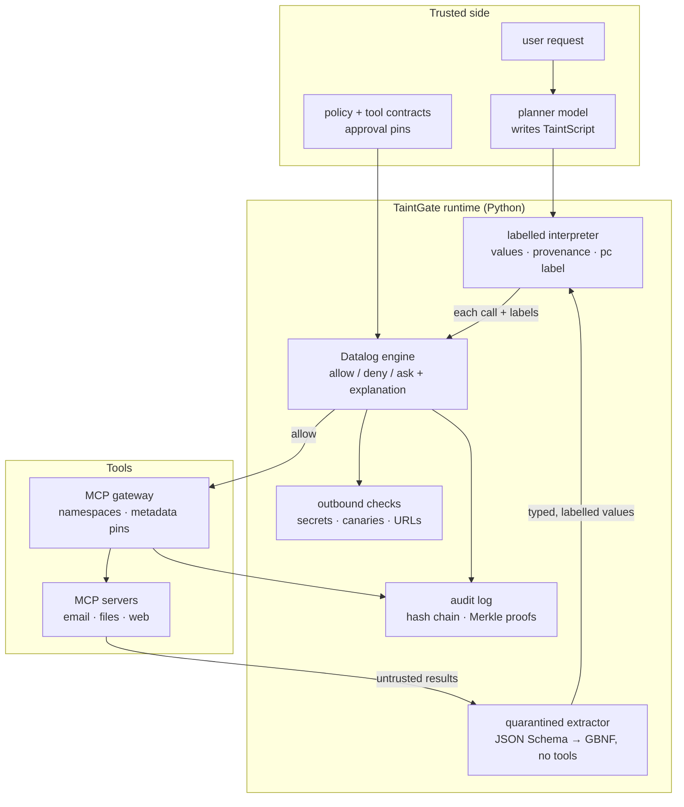
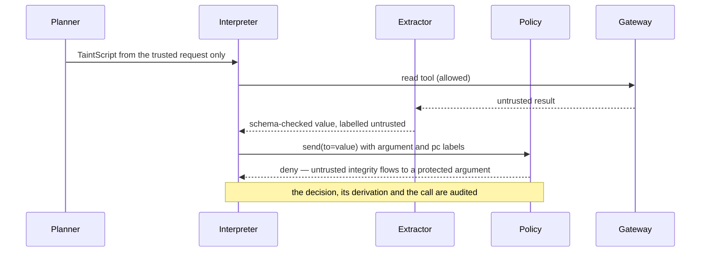

# TaintGate

**An information-flow firewall for LLM agents — labels follow every value, and deterministic policy decides every tool call.**

[](.github/workflows/ci.yml)
[](pyproject.toml)
[](native/)
[](docs/models.md)
[](https://github.com/guru-bharadwaj20/TaintGate/releases/tag/v0.1.0)
[](LICENSE)

An agent reads email, documents, web pages and tool results, and any of them can
carry instructions. TaintGate never lets that text steer a tool call. A planner sees
only the trusted request; untrusted content is read by a tool-free extractor into
typed, labelled values; and every call is checked against integrity, confidentiality
and control-flow labels in deterministic code before it runs.

> Asked to reply to a colleague, the agent reads a poisoned email that names a
> different, attacker-chosen recipient. That recipient value is labelled untrusted,
> the send depends on it, and the policy denies the call — with an explanation and
> an audit record. The trusted send to the real colleague still goes through.

---

## Contents

| Section | |
|---|---|
| [What it does](#what-it-does) | The capability surface, by area |
| [Architecture](#architecture) | How the pieces fit |
| [How a tool call is checked](#how-a-tool-call-is-checked) | Plan, extract, label, decide, audit |
| [Quick start](#quick-start) | From a clean checkout to the demo |
| [Project status](#project-status) | Every phase, all complete |
| [Results](#results) | The AgentDojo comparison, with its limits |
| [Design decisions](#design-decisions) | The tradeoffs, and why |
| [Repository layout](#repository-layout) | Where things live |
| [Documentation](#documentation) | Which file answers which question |

---

## What it does

| Area | Capabilities |
|---|---|
| **Language** | TaintScript, a restricted Python-like language — no imports, functions, classes or mutation; only registered tool calls — run by a custom interpreter with bounded execution |
| **Labels** | An integrity × confidentiality product lattice with provenance; container shape labels; program-counter tracking of implicit flows in strict mode; scoped, audited endorsement and declassification |
| **Policy** | A Datalog engine with safe rules, SCC stratification, indexed semi-naive evaluation and derivation trees explaining every allow / deny / ask |
| **Quarantine** | Bounded JSON Schema to GBNF compilation for a tool-free extractor model, with independent typed validation of its output |
| **Static checks** | Conservative preflight analysis of planner programs; runtime mediation stays mandatory |
| **Gateway** | MCP over stdio and Streamable HTTP via the official SDK, per-server namespaces, metadata approval pins and quarantine on tool-description changes |
| **Outbound** | Reader constraints, secret and canary detection, URL and safe-markdown rendering checks |
| **Audit** | A SQLite hash chain with anchored Merkle roots and inclusion proofs that detect edits and suffix deletion |
| **Evaluation** | An AgentDojo harness comparing six configurations under one CPU model, budget and seed, with resumable hash-pinned checkpoints |

---

## Architecture

The trusted planner and the untrusted extractor never share a context. Values carry
labels through the interpreter, and the gateway asks the policy engine before any
side effect reaches an MCP server.



A Rust prototype in [native/](native/) runs positive reachability rules with
semi-naive propagation; it is an experiment beside the Python engine, not a
replacement for it.

---

## How a tool call is checked



Strict mode keeps control dependencies sticky: once a branch reads untrusted data,
later calls carry that dependency. Permissive mode drops it for utility and is
weaker by design.

---

## Quick start

```bash
# 1 — environment (Python 3.12+; no GPU or model download needed)
python -m venv .venv
.venv/bin/pip install -e ".[dev,mcp,ui]"
.venv/bin/pytest

# 2 — the isolated demo: a trusted send is allowed, a poisoned recipient is blocked
.venv/bin/taintgate demo

# 3 — the local dry-run UI on 127.0.0.1:8000 (enter the printed session token)
.venv/bin/taintgate ui

# 4 — the same demo in a CPU-only container with networking disabled
docker build -t taintgate . && docker run --rm --network none taintgate
```

> The demo's tools record synthetic sends; nothing contacts a real account. Running
> the AgentDojo comparison needs the `bench` extra and the pinned CPU model; see
> [docs/benchmark.md](docs/benchmark.md).

---

## Project status

All nineteen core phases are complete, with tests passing in CI on Python 3.12 and
3.13 and a containerised demo check. Release
[v0.1.0](https://github.com/guru-bharadwaj20/TaintGate/releases/tag/v0.1.0) ships
the wheel, the source distribution and the benchmark reproduction archive.

| Phase | Scope | Status |
|---|---|:---:|
| 1 | Repository and contribution workflow | ✅ |
| 2 | Threat model and architecture | ✅ |
| 3 | CPU model setup and trusted planner | ✅ |
| 4 | Integrity, confidentiality and provenance | ✅ |
| 5 | TaintScript parser and language boundary | ✅ |
| 6 | Labelled interpreter and explicit flows | ✅ |
| 7 | Implicit flows and runtime limits | ✅ |
| 8 | JSON Schema to GBNF and quarantined extraction | ✅ |
| 9 | Datalog parser and reference evaluator | ✅ |
| 10 | Stratification, semi-naive evaluation and explanations | ✅ |
| 11 | MCP gateway transports and isolation | ✅ |
| 12 | Tool metadata approval and change detection | ✅ |
| 13 | Static checking and approval scopes | ✅ |
| 14 | Outbound filtering and secret detection | ✅ |
| 15 | Tamper-evident audit storage | ✅ |
| 16 | Integration, UI and attack laboratory | ✅ |
| 17 | Security properties, regression testing and fuzzing | ✅ |
| 18 | AgentDojo evaluation and reproducibility | ✅ |
| 19 | Documentation, demonstration and release | ✅ |

---

## Results

Complete AgentDojo v1 comparison (`important_instructions` attack, pinned revision
`089ed468`), Qwen2.5-0.5B-Instruct Q4_K_M on CPU, four model calls per run,
temperature 0. Each configuration ran all 97 clean tasks and 629 attacked cases —
4,356 graded runs, zero errors. Raw records are in
[benchmarks/agentdojo_full_results.json](benchmarks/agentdojo_full_results.json).

| Configuration | Clean utility | Utility under attack | Attack success | Approvals |
|---|---:|---:|---:|---:|
| Plain agent | 4/97 | 36/629 | 0/629 | 0 |
| Spotlighting | 4/97 | 36/629 | 0/629 | 0 |
| Sandwich | 4/97 | 36/629 | 0/629 | 0 |
| Prompt Guard 2 (0.5) | 4/97 | 36/629 | 0/629 | 0 |
| TaintGate permissive | 4/97 | 36/629 | 0/629 | 93 |
| TaintGate strict | 4/97 | 36/629 | 0/629 | 93 |

**Read this as a floor, not a win.** The four passing tasks are exactly those an
agent making no calls also passes, and the undefended agent also scores 0/629: the
0.5B model rarely produced a valid tool call (168 of 189 distinct baseline responses
were invalid), so attacks seldom got a chance to act. The comparison does not distinguish the defenses, and it is not evidence that
TaintGate reduces attack success; a larger planner is needed for that. TaintGate's
policy check itself costs a median 0.6 ms per call. Per-host timings and the full
analysis are in [docs/results.md](docs/results.md).

---

## Design decisions

**Separate the planner from untrusted text entirely.** Detectors and prompt
formatting ask a model to resist instructions it has already read. Following
[CaMeL](https://css.csail.mit.edu/6.858/2026/readings/camel.pdf), the planner never
reads tool output; it writes a program, and data reaches it only as labelled values.

**Enforce in deterministic code, not in a model.** Every decision comes from Datalog
over explicit facts, so it is reproducible and explainable — the derivation tree
says which label and rule produced each allow, deny or ask.

**Track implicit flows, and say what that costs.** Strict mode labels control
dependencies, in the spirit of
[FIDES](https://www.microsoft.com/en-us/research/publication/securing-ai-agents-with-information-flow-control/),
and accepts lower utility for it. Permissive mode is offered and documented as
weaker rather than presented as equivalent.

**Treat grammars, scans and DLP as limited mechanisms.** A schema-valid string can
still carry malicious text, and metadata pinning cannot prove a remote server's
behaviour; these layers narrow the attack surface without being trusted alone.

**Keep negative results.** The benchmark outcome above, the Prompt Guard 2 miss on a
synthetic injection (score 0.494 at a fixed 0.5 threshold) and a failed checkpoint
write during the run are all recorded, not tuned away.

---

## Repository layout

```
.
├── taintgate/     the package: lang, interp, labels, policy, quarantine, static,
│                  gateway, dlp, audit, inference, bench, ui, demo and CLI
├── tests/         unit, property, integration, attack and fuzz suites
├── benchmarks/    measured results as JSON, with the scripts that produce them
├── config/        pinned model and benchmark configuration
├── native/        Rust semi-naive reachability prototype
├── scripts/       demo recording, native build and fuzzing helpers
├── docs/          reference documentation (see below)
└── Dockerfile     CPU-only container running the demo
```

---

## Documentation

| Question | File |
|---|---|
| *What is trusted, and which attacks are in scope?* | [docs/threat-model.md](docs/threat-model.md) |
| *How do I write TaintScript?* | [docs/language.md](docs/language.md) |
| *How do labels, endorsement and declassification work?* | [docs/labels.md](docs/labels.md) |
| *How are policies written and evaluated?* | [docs/policy.md](docs/policy.md), [docs/static.md](docs/static.md) |
| *How does quarantined extraction work?* | [docs/quarantine.md](docs/quarantine.md) |
| *How do I connect and approve MCP tools?* | [docs/gateway.md](docs/gateway.md), [docs/onboarding.md](docs/onboarding.md) |
| *What do outbound checks and the audit log guarantee?* | [docs/dlp.md](docs/dlp.md), [docs/audit.md](docs/audit.md) |
| *How is it tested?* | [docs/security-testing.md](docs/security-testing.md), [docs/attack-lab.md](docs/attack-lab.md) |
| *Which models run on CPU, and how fast?* | [docs/models.md](docs/models.md) |
| *How is the benchmark run, and what did it measure?* | [docs/benchmark.md](docs/benchmark.md), [docs/results.md](docs/results.md) |
| *What are the extensions and the demo?* | [docs/extensions.md](docs/extensions.md), [docs/demo.md](docs/demo.md) |
| *Which licenses apply to models and dependencies?* | [docs/licenses.md](docs/licenses.md) |

---

## License

[MIT](LICENSE). Model weights are not redistributed; see [docs/licenses.md](docs/licenses.md).
