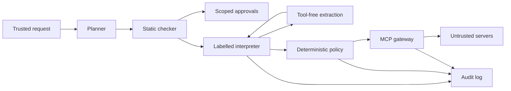

## Trusted inputs

The user request and locally administered policy, tool contracts, server configuration and approval records are trusted. The TaintGate process and host must preserve their integrity. Planner output remains syntactically and operationally restricted; a trusted view does not imply an infallible planner.

## Untrusted inputs

Tool results, documents, email, web content, extraction output and remote tool descriptions are untrusted. Apply configured confidentiality to structured content and errors as well as plain text. No remote description establishes its own trust.

## A1: unauthorized actions

A poisoned email asks an agent to delete a file or transfer money. The runtime can call only registered tools; protected side effects require explicit policy allow and trusted control dependencies in strict mode.

## A2: argument hijacking

A document substitutes an attacker email address for a user-selected recipient. Recipients derived from untrusted inputs require endorsement or a narrowly scoped approval; strings extracted under a schema remain untrusted.

## A3: exfiltration

A private invoice is sent through an email body, URL query, markdown image or final response. Reader constraints apply at sinks, and outbound rendering must not fetch attacker-controlled resources.

## A4: tool poisoning

A tool description instructs the model to disclose secrets or use another tool. Only trusted local contracts enter planner prompts; remote description scanning is supplemental and cannot prove benign intent.

## A5: metadata changes

A server changes its schema or description after approval. Canonical metadata hashes bind approval to a version; a mismatch quarantines the tool and requires a new approval.

## A6: shadowing

A server impersonates another server tool or instructs the model how to use it. Namespaces and approved local signatures keep tool identity separate from server-authored prose.

## A7: secret leakage

An API key, hidden instruction or synthetic canary appears in outbound content. Reader checks provide the information-flow boundary; pattern and canary scans provide additional detection with documented false negatives.

## Excluded threats

Malicious user requests, compromised hosts or policy administrators, model-weight compromise, timing/resource side channels and harmful-content jailbreaks are excluded. A malicious server may lie about its own behavior; metadata pinning cannot prove what a remote implementation executes.

## Architecture

## Planner input contract

A prompt contains the user request, locally approved tool signatures, language instructions and trusted error codes only. It excludes tool results, extraction outputs, raw server metadata, confidential runtime values and copied exception messages.

## Strict and permissive modes

Strict mode joins the program-counter label with protected action arguments. Permissive mode tracks explicit data flows only and permits attacker control over conditional constant-argument actions. Permissive mode is a comparison configuration, not equivalent protection.

## Observable actions

Compare protected side-effect traces by tool identity, destination and argument values for worlds agreeing on trusted inputs. Explicit scoped approvals and policy-authorized data flows are exceptions. Do not demand identical results for deliberately permitted extraction or data-dependent reads. This is a policy-relative property, not unconditional noninterference.

## Reads versus side effects

A configured read capability may accept untrusted search terms within a restricted dataset. Sending, writing, deleting, transferring and externally observable network requests are protected sinks. A remote read can itself leak its arguments, so read classification must include destination and confidentiality constraints.

## Fail closed and trusted base

Unknown tools, malformed plans, unsupported syntax, policy errors, missing approvals and changed pins deny execution. The trusted base includes the parser, label propagation, policy engine, gateway enforcement, approval storage and configuration. Audit storage provides evidence but does not substitute for enforcement.

## Prior work

The split planner and extraction design follows CaMeL; integrity and confidentiality tracking also follows FIDES. Planned extensions include an explainable custom Datalog engine, conservative static analysis, an MCP gateway, outbound filters and Merkle audit proofs. Claims concern implemented and measured extensions only.
